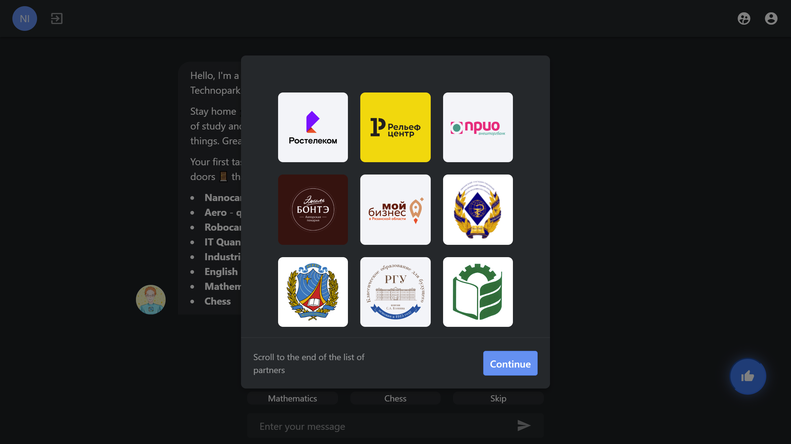

# Chatbot online game

Ready-made online game with reward system. 

### Articles

* [How we organized an offline event in an online format due to COVID-19 - Medium.com](https://medium.com/marcius-studio/how-we-organized-an-offline-event-in-an-online-format-due-to-covid-19-ba2de0845626)
* [Habr.com](https://habr.com/ru/post/513046/)



## Features

Functional: chatbot, admin, user profile, virtual money (points), list of gifts.

**Client-side** 

* [x] Vue.js 2.x
* [x] Vue Apollo

**Server-side**

* [x] Apollo GraphQL
* [x] MongoDB Atlas as Mongoose

Сommunication Full Websocket Transport.

## Installation

Required [Nodejs LTS](https://nodejs.org/en/) 

```node
$ cd client && yarn
$ cd server && yarn
```

### Run

```node
$ cd client && yarn run serve
$ cd server && yarn run start
```

### Build

```node
$ cd client && yarn run build
$ cd server && yarn run build
```

## Stay in touch

Feel free to ask questions 😊

* Discord: Nikita Marcius#2274
* Telegram: [@nikitamarcius](https://ttttt.me/nikitamarcius)

## Contributors

<a href="https://github.com/marcius-studio">

</a>

